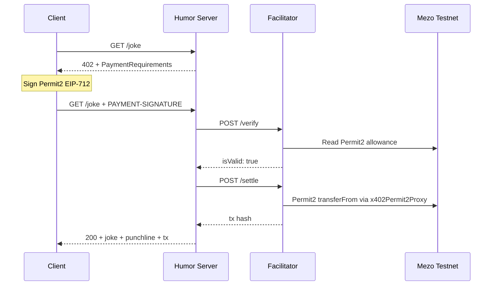

# mezo-x402

Pay-per-request joke API on [Mezo Testnet](https://mezo.org) using the [x402 payment protocol](https://github.com/coinbase/x402). A client requests a joke, gets a `402 Payment Required` response, signs a Permit2 authorization for 0.001 mUSD, and retries — the server verifies payment, settles on-chain, and returns the punchline.



## Quickstart

**Requirements:** Node.js 18+, pnpm, and funded Mezo testnet wallets.

```bash
git clone https://github.com/ryanRfox/mezo-x402.git
cd mezo-x402
pnpm install
pnpm --filter mezo-x402-sdk build
```

> **Note:** You may see a `keccak` node-gyp warning during `pnpm install` — this is safe to ignore. The WASM fallback is used automatically.

Copy `.env.example` to `.env` in each service directory and fill in your wallet keys:

```bash
cp facilitator/.env.example facilitator/.env
cp server/.env.example server/.env
cp client/.env.example client/.env
# Edit each .env file — add private keys and payee address
# Private keys are hex strings with 0x prefix, e.g.: 0xac0974bec39a17e36ba4a6b4d238ff944bacb478cbed5efcae784d7bf4f2ff80
```

Then open three terminals:

**Terminal 1 — Facilitator** (verifies payments, settles on-chain)

```bash
cd facilitator && npx tsx facilitator.ts
# Listening on :4022
```

**Terminal 2 — Humor Server** (joke paywall)

```bash
cd server && npx tsx humor-server.ts
# Listening on :3000
```

**Terminal 3 — Client** (pays for a joke)

> **First run?** Complete the [Permit2 Approval](#permit2-approval) step below before running the client.

```bash
cd client && npx tsx client.ts
```

The client gets a 402, signs a Permit2 authorization, retries with the payment header, and receives the joke punchline along with the on-chain settlement transaction hash.

## Environment

The x402 flow uses three wallets:

| Wallet | Purpose | Funding needed |
|--------|---------|----------------|
| **Facilitator** | Submits `settle()` transactions | Testnet BTC (gas) |
| **Payee** | Receives mUSD payments | None |
| **Client** | Signs Permit2 authorizations | Testnet mUSD + BTC (Permit2 approval) |

Get testnet funds from the [Mezo Faucet](https://faucet.test.mezo.org).

### Wallet Setup

If you don't already have an EVM wallet, generate one with [Foundry](https://github.com/foundry-rs/foundry):

```bash
cast wallet new
# Or use MetaMask / any EVM wallet — export the private key from settings
```

Private keys are hex strings with a `0x` prefix (e.g., `0xac0974...`). Each `.env.example` shows which key or address is needed.

**Funding requirements:**
- **Client wallet** needs testnet mUSD (to pay for resources) and a small amount of testnet BTC (for the one-time Permit2 approval transaction).
- **Facilitator wallet** needs testnet BTC (for gas on `settle()` transactions).
- **Payee** is just an address — no funding needed.

Request testnet tokens from the [Mezo Faucet](https://faucet.test.mezo.org).

### Permit2 Approval

Before the client can pay, the Permit2 contract must be approved to transfer mUSD on behalf of the client wallet. This is a standard ERC-20 `approve()` — a one-time on-chain transaction that costs a small amount of testnet BTC for gas.

```bash
# Approve Permit2 to spend your mUSD (one-time, from client wallet)
cast send 0x118917a40FAF1CD7a13dB0Ef56C86De7973Ac503 \
  "approve(address,uint256)" \
  0x000000000022D473030F116dDEE9F6B43aC78BA3 \
  $(cast max-uint) \
  --private-key $CLIENT_PRIVATE_KEY \
  --rpc-url https://rpc.test.mezo.org
```

After approval, the x402 payment flow works automatically: the client signs a Permit2 EIP-712 message (off-chain, no gas), and the facilitator calls `transferFrom` via the x402 proxy to settle on-chain.

> **Tip:** The client logs a warning at startup if Permit2 is not yet approved.

Each service has its own `.env.example` — copy to `.env` and fill in wallet keys:

| Service | Key vars to fill in |
|---------|-------------------|
| `facilitator/.env` | `FACILITATOR_PRIVATE_KEY` |
| `server/.env` | `PAYEE_ADDRESS` |
| `client/.env` | `CLIENT_PRIVATE_KEY` |

Network addresses and contract addresses are pre-filled in the `.env.example` files.

## Project Structure

```
client/         Payment client (signs Permit2, retries with payment header)
server/         Humor server (joke paywall demo)
facilitator/    x402 facilitator (verify + settle endpoints)
sdk/            mezo-x402-sdk: Mezo chain definitions, mUSD config
patches/        Patched @x402/evm with PROXY_ADDRESS env override
```

See each component directory (`facilitator/`, `server/`, `client/`) for per-service setup details and environment variable reference.

## Contract Addresses (Mezo Testnet, chain 31611)

| Contract | Address |
|----------|---------|
| Permit2 | `0x000000000022D473030F116dDEE9F6B43aC78BA3` |
| x402Permit2Proxy | `0x8dea1b08dc2e1D9b556450f736F19968F367A98d` |
| mUSD | `0x118917a40FAF1CD7a13dB0Ef56C86De7973Ac503` |

## Known Issues

**EIP-7623 gas estimation:** Mezo's `eth_estimateGas` omits the EIP-7623 calldata floor, causing Permit2 `settle()` to fail. The facilitator applies a 3x gas multiplier as a workaround. Tracked upstream.

**Patched `@x402/evm`:** The proxy contract address is hardcoded in upstream `@x402/evm`. This project uses a patched tarball that reads `PROXY_ADDRESS` from the environment. The patch will be removed once Mezo's proxy is deployed at the canonical CREATE2 address.
